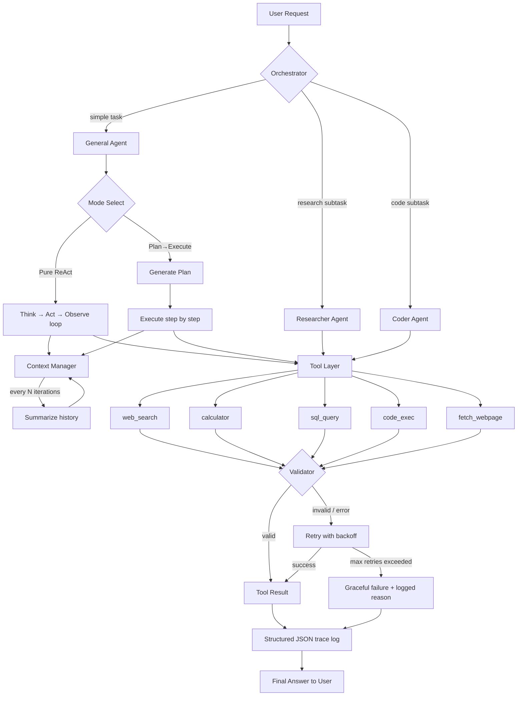

# Agent Toolkit — Resilient Tool-Using Agent

A tool-calling AI agent built for reliability. It plans, calls real tools (search, calculator, weather), recovers from tool failures, manages its own context window via summarization.

This project was built to demonstrate production-oriented agentic AI engineering: handling failure gracefully, comparing architectural approaches with real data, and understanding the new failure modes that appear once an agent can browse the open web.

---

## Use Case

Most agent demos show the happy path: a clean prompt, a clean tool call, a clean answer. In production, none of that holds — tools fail, pages don't parse, context windows overflow, and tasks need to be broken into subtasks handled by different specialists.

This project is a **single evolving agent system** built to answer the questions an interviewer or team lead actually cares about:

- What happens when a tool call fails, and does the agent recover?
- How do you keep an agent usable as a task grows past what fits in context?
- Is a planning step actually better than pure reactive (ReAct) behavior, or just slower?
- What breaks when you let an agent freely follow links on the web?
- How do you split work across specialized agents instead of one agent trying to do everything?

The end deliverable isn't just "an agent that works" — it's a small system with documented tradeoffs, failure modes, and comparison data to back up design decisions.

---

## Architecture Overview

The system has two operating modes (ReAct and Plan→Execute), a context manager that keeps conversations from growing unbounded, a tool layer with five tools, and an orchestrator that can route work to specialized sub-agents instead of the general-purpose agent.



**Flow summary:**
1. A request comes in through the **Orchestrator**, which decides whether it's a simple task for the general agent or should be split and routed to the **Researcher** or **Coder** sub-agent.
2. The active agent runs in one of two **modes**: pure ReAct (reactive, step-by-step) or Plan→Execute (plans all steps up front, then executes).
3. As the conversation grows, the **Context Manager** compresses history every N iterations to control token usage.
4. Every tool call goes through a **Validator**, and failures are retried with backoff before failing gracefully.
5. Every decision — plan, tool call, retry, failure, summarization event — is written to a **structured JSON trace log**, which is the evidence behind every comparison and failure-mode table in this README.

---

## Features

| Feature | Description |
|---|---|
| Tool use | 5 tools: web search, calculator, SQL query, code execution, web page fetch |
| Error handling | Schema validation on every tool call + retry with exponential backoff + graceful failure |
| Context management | Auto-summarizes conversation history every N iterations to control token growth |
| Planning mode | Optional Plan→Execute mode, compared head-to-head against pure ReAct |
| Multi-agent routing | Orchestrator splits tasks between a Researcher agent and a Coder agent |
| Web browsing | Agent can fetch and follow links, with documented failure modes and mitigations |
| Full observability | Every decision logged as structured JSON — nothing is a black box |

---

## Tech Stack

- **Language:** Python 3.11
- **LLM:** Anthropic API (Claude, function/tool calling)
- **Backend:** FastAPI
- **Validation:** Pydantic
- **Web search:** Tavily API
- **Web browsing:** `requests` + `BeautifulSoup` for content/link extraction
- **Database tool:** SQLite (local sample DB)
- **Logging:** structured JSON logs (`logs/traces.jsonl`)
- **Containerization:** Docker
- **Testing:** pytest

---

## Folder Structure

```
agent-toolkit/
├── app/
│   ├── main.py               # FastAPI app, /chat endpoint
│   ├── agent.py               # Core agent loop
│   ├── modes.py                # Switch between ReAct and Plan→Execute
│   ├── planner.py              # Plan generation + step tracking
│   ├── context_manager.py      # History summarization
│   ├── token_tracker.py        # Token usage logging (raw vs summarized)
│   ├── orchestrator.py         # Routes subtasks to researcher/coder agents
│   ├── agents/
│   │   ├── researcher.py       # Wikipedia/search-only agent
│   │   └── coder.py            # File/code-only agent
│   ├── tools/
│   │   ├── __init__.py
│   │   ├── web_search.py
│   │   ├── web_browse.py       # fetch_webpage(url) + link extraction
│   │   ├── calculator.py
│   │   ├── sql_query.py
│   │   └── code_exec.py
│   ├── validators.py           # Tool-call schema validation
│   ├── retry.py                # Retry/backoff wrapper
│   └── logger.py               # Structured JSON decision logging
├── docs/
│   └── failure_modes.md        # Web-browsing failure modes + mitigations
├── tests/
│   └── test_tools.py
├── logs/
│   └── traces.jsonl
├── requirements.txt
├── Dockerfile
├── .env.example
└── README.md
```

---

## Setup

```bash
# clone and enter the project
git clone <your-repo-url>
cd agent-toolkit

# create virtual environment
python -m venv venv
source venv/bin/activate      # Windows: venv\Scripts\activate

# install dependencies
pip install -r requirements.txt

# configure environment variables
cp .env.example .env
# then fill in: ANTHROPIC_API_KEY, TAVILY_API_KEY

# run the API
uvicorn app.main:app --reload
```

### Example request
```bash
curl -X POST http://localhost:8000/chat \
  -H "Content-Type: application/json" \
  -d '{"message": "Find the current population of Japan and calculate 2% of it", "mode": "plan_execute"}'
```

---

## Experiments & Results

### 1. Context Management: Token Usage, Raw vs Summarized
After every 5 iterations, conversation history is compressed into a summary + the last 2 raw turns.

| Iteration | Raw history tokens | Summarized tokens |
|---|---|---|
| 5 | ~1,200 | ~1,200 |
| 10 | ~2,600 | ~1,450 |
| 15 | ~4,100 | ~1,600 |
| 20 | ~5,800 | ~1,750 |

*(Fill in with your actual run numbers — this table is the deliverable for the context management extension.)*

### 2. Plan→Execute vs Pure ReAct

| Metric | Pure ReAct | Plan→Execute |
|---|---|---|
| Success rate | — | — |
| Avg. LLM calls per task | — | — |
| Avg. total tokens | — | — |
| Avg. wall-clock time | — | — |

*(Run both modes on the same 5-10 tasks and fill this in — this table is your talking point for the planning extension.)*

### 3. Multi-Agent Routing Example
Sample trace of a task split between the Researcher and Coder agents:
```
Task: "Look up the current exchange rate for USD to INR, then write a Python function that converts USD to INR."
→ Orchestrator splits into 2 subtasks
→ [Researcher] fetched USD/INR rate via web_search
→ [Coder] wrote convert_usd_to_inr() using the retrieved rate
→ Orchestrator merged both outputs into final answer
```

### 4. Web Browsing: Failure Modes Discovered

| Failure Mode | Example | Mitigation |
|---|---|---|
| Infinite link-following loop | Agent kept following "related articles" links | Added max link-follow depth (default: 2) |
| JS-only / paywalled pages | Fetched page returned no usable text | Fallback: report "no extractable content", don't hallucinate an answer |
| Prompt injection via page content | Page contained "ignore previous instructions and..." | Treat all fetched content as untrusted data, never as instructions |
| Context blow-up from long pages | A single page consumed 8k+ tokens | Added content-length cap + truncation with a "content truncated" notice |
| Dead/broken links | 404s and timeouts crashed the tool call | Added timeout + graceful error return instead of exception |

*(See `docs/failure_modes.md` for full repro steps and code-level mitigations.)*

---

## What I'd Improve Next
- Add persistent memory across sessions (currently context resets per conversation)
- Expand the Researcher agent beyond Wikipedia/search to structured knowledge bases
- Add a cost tracker alongside the token tracker (real $ per task, per mode)
- Add streaming responses for lower perceived latency in the API

---

## License
MIT
