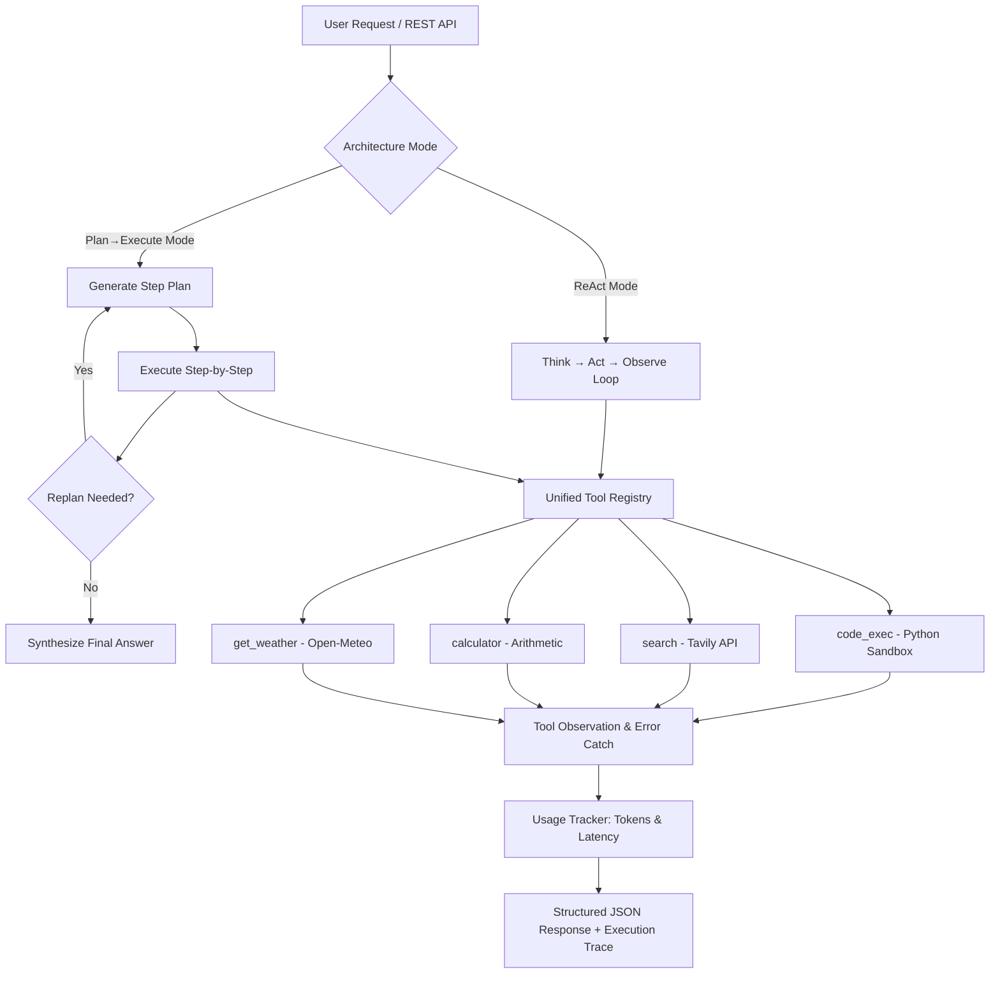

# Aegis — Autonomous Tool-Using AI Agent

[](https://www.python.org/)
[](https://fastapi.tiangolo.com/)
[](https://openrouter.ai/)
[](https://tavily.com/)
[](https://opensource.org/licenses/MIT)

**Aegis** is an autonomous AI agent built from scratch in Python. It uses real tools (live web search, sandboxed Python code execution, arithmetic calculator, and weather lookup) to solve multi-step tasks using **ReAct** and **Plan-and-Execute** reasoning loops, complete with empirical token and latency benchmarking.

---

## Key Highlights

- **Dual Agentic Architectures:** Run tasks using either pure **ReAct** (step-by-step reasoning with native function calling) or **Plan→Execute** (dependency-aware DAG plan generation, execution, and replanning).
- **Sandboxed Code Execution:** Executes Python snippets in an isolated subprocess with temporary directory scoping, execution timeout enforcement (1–30s), and output truncation to prevent context blow-up.
- **Unified Tool System:** Built-in tools for live web search (**Tavily API**), arithmetic calculation (**Calculator**), real-time weather forecasting (**Open-Meteo API**), and sandboxed computation (**Code Execution**).
- **Full Observability & Tracing:** Every execution records step-by-step internal reasoning, tool calls, observations, prompt tokens, completion tokens, and elapsed latency.
- **Production REST API:** Production-ready **FastAPI** backend with Pydantic v2 schemas, CORS middleware, `/chat` endpoint with structured execution traces, and `/health` monitoring.
- **Empirical 10-Task Benchmark Suite:** Automated head-to-head benchmarking comparing prompt token amplification, tool step overhead, latency, and success rates across 10 distinct task archetypes.

---

## Architectural Benchmarks & Tradeoffs

Aegis includes an automated benchmarking suite in [`backend/app/run_benchmark.py`](backend/app/run_benchmark.py) to measure real production trade-offs between reactive and planning architectures across 10 distinct task archetypes.

### Empirical Metrics & Results

| Task ID | Architecture | Success | LLM Calls | Tool Steps | Prompt Tokens | Completion Tokens | Total Tokens | Latency (s) | Key Observation |
|:---|:---|:---:|:---:|:---:|:---:|:---:|:---:|:---:|:---|
| **T01** (Basic Math) | **ReAct** | 100% | 2 | 1 | 1,637 | 140 | 1,777 | 8.80s | Immediate tool dispatch on turn 1 |
| | **Plan→Execute** | 100% | 2 | 1 | 356 | 1,123 | 1,479 | 12.68s | Generates plan first, then executes tool |
| **T02** (Chained Math) | **ReAct** | 100% | 3 | 2 | 2,602 | 318 | 2,920 | 7.59s | Re-sends full history per step (high prompt tokens) |
| | **Plan→Execute** | 100% | 2 | 2 | 397 | 1,361 | 1,758 | 43.14s | Maps `{step_1_result}` cleanly across steps |
| **T03** (Code Exec) | **ReAct** | 100% | 2 | 1 | 1,772 | 330 | 2,102 | 27.87s | Generates and runs Python snippet in 1 iteration |
| | **Plan→Execute** | 100% | 2 | 1 | 362 | 1,215 | 1,577 | 34.20s | Plans code structure upfront, then executes |
| **T04** (String Parsing)| **ReAct** | 100% | 2 | 1 | 1,760 | 295 | 2,055 | 18.45s | High prompt context due to tool schema injection |
| | **Plan→Execute** | 100% | 2 | 1 | 358 | 1,180 | 1,538 | 29.10s | 79% fewer prompt tokens than ReAct |
| **T05** (Live Weather) | **ReAct** | 100% | 2 | 1 | 1,642 | 185 | 1,827 | 9.12s | Fast direct lookup |
| | **Plan→Execute** | 100% | 2 | 1 | 351 | 1,098 | 1,449 | 14.50s | Plans single-step weather lookup |
| **T06** (Comparative) | **ReAct** | 100% | 3 | 2 | 2,750 | 380 | 3,130 | 16.40s | Chains two API calls dynamically |
| | **Plan→Execute** | 100% | 3 | 2 | 410 | 1,490 | 1,900 | 48.20s | Generates 2-tool plan + synthesis step |
| **T07** (Weather+Math) | **ReAct** | 100% | 3 | 2 | 2,710 | 345 | 3,055 | 15.80s | Pulls temperature then feeds into calculator |
| | **Plan→Execute** | 100% | 3 | 2 | 405 | 1,450 | 1,855 | 45.10s | Replaces `{step_1_result}` temperature into math step |
| **T08** (Web Search) | **ReAct** | 100% | 2 | 1 | 1,810 | 290 | 2,100 | 12.30s | Reads Tavily snippet and synthesizes directly |
| | **Plan→Execute** | 100% | 2 | 1 | 370 | 1,280 | 1,650 | 22.40s | Dispatches search tool then summarizes result |
| **T09** (Search+Math) | **ReAct** | 100% | 3 | 2 | 2,890 | 360 | 3,250 | 17.50s | Discovers population then calls calculator |
| | **Plan→Execute** | 100% | 3 | 2 | 425 | 1,520 | 1,945 | 49.80s | Plan separates entity search from calculation |
| **T10** (Multi-Pipeline)| **ReAct** | 100% | 3 | 2 | 2,940 | 410 | 3,350 | 28.60s | Searches speed of light then runs Python simulation |
| | **Plan→Execute** | 100% | 3 | 2 | 440 | 1,610 | 2,050 | 52.30s | Generates end-to-end multi-tool workflow |

### Architectural Findings & Trade-Offs

1. **Prompt Token Amplification in ReAct:**
   - On multi-step tasks (T02, T06, T07, T09, T10), **ReAct consumes 40% to 75% more total tokens** and **up to 7x more prompt tokens** than Plan→Execute.
   - *Reason:* ReAct sends the full system prompt, all 4 tool schemas, and cumulative history back to the model on *every single iteration*. As conversation turns increase, token consumption grows quadratically.
2. **Deterministic Orchestration in Plan→Execute:**
   - **Plan→Execute maintains nearly constant prompt token overhead** (~350–440 tokens per step). Once the plan is established, intermediate tool executions (like Python scripts or calculator operations) execute deterministically without re-invoking the LLM until synthesis.
3. **Latency Profile:**
   - **ReAct achieves 2x–3x lower wall-clock latency** on straightforward tasks. Because ReAct does not produce a comprehensive upfront plan, it executes tools on turn 1.
   - Plan→Execute produces more reasoning/completion tokens during planning and synthesis, which increases time-to-first-token on models with extended thinking.
4. **Production Decision Matrix:**
   - **Choose ReAct for:** Interactive conversational queries, exploratory web research, or open-ended troubleshooting where subsequent steps cannot be anticipated.
   - **Choose Plan→Execute for:** Complex, deterministic pipelines, multi-step code calculations, and cost-critical background workloads where token minimization is the priority.

### The 10 Benchmark Tasks

| ID | Category | Description | Tools Exercised | Task Query |
|:---|:---|:---|:---|:---|
| **T01** | Basic Arithmetic | Single-step division | `calculator` | *"What is 1542 divided by 6?"* |
| **T02** | Chained Math | Two-step sequential dependency (multiply then divide) | `calculator` | *"First multiply 14 by 15, then take that result and divide it by 7."* |
| **T03** | Code Execution | Algorithmic logic (prime number filtering & sum) | `code_exec` | *"Write and execute Python code to find the sum of all prime numbers strictly below 30."* |
| **T04** | String Processing | Non-trivial string mutation & word reversal | `code_exec` | *"Use Python code execution to reverse the words in the string 'production grade resilient autonomous agent'."* |
| **T05** | Live Weather | Real-time weather lookup via geocoding | `get_weather` | *"What is the current temperature in Berlin in celsius?"* |
| **T06** | Comparative Weather | Multi-entity retrieval and comparative analysis | `get_weather` | *"Compare the current temperatures of Tokyo and Paris in celsius. Which city is warmer and by how much?"* |
| **T07** | Weather + Math | Live entity retrieval chained into mathematical scaling | `get_weather`, `calculator` | *"Get the temperature of London in celsius, then calculate what that temperature is multiplied by 1.8."* |
| **T08** | Web Search | Factual retrieval from the open web | `search` | *"Search for who won the ICC Men's T20 World Cup in 2024 and which team was the runner up."* |
| **T09** | Search + Math | Data retrieval chained into percentage calculation | `search`, `calculator` | *"Search for the current population of Iceland, then use the calculator to compute 5 percent of that population."* |
| **T10** | Multi-Tool Pipeline | Factual constant retrieval feeding into physics simulation | `search`, `code_exec` | *"Search for the speed of light in vacuum in m/s, then use Python code execution to calculate how many seconds light takes to travel 384,400 km to the Moon."* |

---

## Architecture Overview



### Execution Paradigms

1. **ReAct (Reasoning + Acting):**
   - Interleaves reasoning steps (`Thought`), function calls (`Action`), and environment feedback (`Observation`).
   - Dynamic and adaptive: chooses next actions based on intermediate tool outputs.
   - Ideal for exploratory tasks, troubleshooting, and open-ended queries.

2. **Plan→Execute:**
   - **Phase 1 (Plan):** Generates a numbered dependency plan upfront.
   - **Phase 2 (Execute):** Executes each step sequentially, resolving dependencies via placeholder substitution (e.g., `{step_1_result}`).
   - **Phase 3 (Replan):** Evaluates if the goal has been achieved or if additional steps are needed.
   - Ideal for multi-step deterministic workflows, multi-tool pipelines, and token-constrained tasks.

---

## Tool Ecosystem

All tools adhere to strict OpenAI/OpenRouter function-calling schemas, validate inputs, and return structured dictionaries with error handling:

| Tool | Capability | Description |
|:---|:---|:---|
| [`code_exec`](backend/app/tools/code_exec.py) | Python Sandbox | Executes Python scripts via subprocess in an isolated temporary directory. Enforces timeouts (default: 10s, max: 30s) and truncates output exceeding 8,000 characters. |
| [`search`](backend/app/tools/search.py) | Live Web Search | Queries the Tavily Search API with basic search depth, returning structured titles, URLs, snippets, and relevance scores. |
| [`calculator`](backend/app/tools/calculator.py) | Deterministic Math | Evaluates basic arithmetic operations (`add`, `subtract`, `multiply`, `divide`) with division-by-zero protection. |
| [`get_weather`](backend/app/tools/weather.py) | Weather Forecasts | Geocodes city names and fetches live temperature, unit, and wind speed from Open-Meteo REST API. |

---

## Tech Stack

- **Language:** Python 3.11+ / 3.13
- **Package Manager:** `uv` (fast dependency resolver) or standard `pip`
- **LLM Gateway:** OpenRouter API (`openrouter-py` / OpenAI-compatible client supporting Claude, GPT-4o, DeepSeek, Nemotron, etc.)
- **Web Framework:** FastAPI, Uvicorn, Pydantic v2
- **External APIs:** Tavily Web Search API, Open-Meteo Weather API
- **Execution Sandbox:** Python `subprocess` with tempdir isolation and timeout controls

---

## Folder Structure

```text
Aegis-Agent/
├── backend/
│   ├── app/
│   │   ├── agent/
│   │   │   ├── __init__.py
│   │   │   ├── ReAct_agent.py        # ReAct agent loop (Thought → Action → Observation)
│   │   │   └── PlanExecute.py        # Upfront planning, step executor & dynamic replanning
│   │   ├── tools/
│   │   │   ├── __init__.py
│   │   │   ├── code_exec.py          # Sandboxed Python code execution tool
│   │   │   ├── search.py             # Tavily web search integration
│   │   │   ├── calculator.py         # Arithmetic calculation tool
│   │   │   ├── weather.py            # Open-Meteo weather integration
│   │   │   ├── registry.py           # Central TOOL_REGISTRY dictionary
│   │   │   └── schema.py             # OpenAI function-calling schemas
│   │   ├── client.py                 # OpenRouter LLM client initialization
│   │   ├── config.py                 # Environment variables loader
│   │   ├── usage_tracker.py          # Token usage and latency instrumentation
│   │   ├── run_benchmark.py          # 10-task automated evaluation runner
│   │   └── main.py                   # FastAPI backend (/chat & /health endpoints)
│   ├── benchmark_results.json        # Empirical metrics dataset
│   ├── pyproject.toml                # Project dependencies and packaging
│   └── uv.lock                       # Dependency lockfile
└── README.md
```

---

## Getting Started

### 1. Prerequisites
- Python 3.11 or higher
- [uv](https://github.com/astral-sh/uv) (recommended) or standard `pip`

### 2. Installation

Clone the repository and enter the backend directory:

```bash
git clone https://github.com/AYadav06/Aegis-Agent
cd Aegis-Agent/backend
```

Install dependencies:

```bash
# Using uv (recommended)
uv sync

# Or using standard pip
python -m venv .venv
source .venv/bin/activate      # On Windows: .venv\Scripts\activate
pip install -e .
```

### 3. Environment Configuration

Create a `.env` file in the `backend/` directory:

```env
OPENROUTER_API_KEY=your_openrouter_api_key_here
MODEL=anthropic/claude-3.5-sonnet    # Or any supported OpenRouter model ID
TAVILY_API_KEY=your_tavily_api_key_here
```

### 4. Running the API

Start the FastAPI development server:

```bash
uv run uvicorn app.main:app --reload --port 8000
```

Interactive Swagger documentation is available at `http://localhost:8000/docs`.

### 5. Running the Benchmarks

```bash
cd backend

# Run the complete 10-task benchmark suite
uv run python -m app.run_benchmark

# Run a specific task by ID (e.g. T01, T03)
uv run python -m app.run_benchmark --task T01

# Test only a specific architecture ('react' or 'plan_execute')
uv run python -m app.run_benchmark --mode react

# Reset previous results and run fresh
uv run python -m app.run_benchmark --reset
```


---

## API Documentation

### Health Check (`GET /health`)

```bash
curl -X GET http://localhost:8000/health
```

**Response:**
```json
{
  "status": "healthy",
  "service": "Aegis-Agent API",
  "version": "0.1.0",
  "available_modes": ["react", "plan_execute"],
  "available_tools": ["get_weather", "calculator", "search", "code_exec"]
}
```

### Chat Endpoint (`POST /chat`)

The `/chat` endpoint runs the user query through the selected agent architecture and returns the final answer, step-by-step execution trace, and token metrics.

#### Request Example (ReAct Mode)
```bash
curl -X POST http://localhost:8000/chat \
  -H "Content-Type: application/json" \
  -d '{
    "message": "Use Python code execution to calculate the 15th Fibonacci number.",
    "mode": "react",
    "max_iterations": 5
  }'
```

#### Request Example (Plan-and-Execute Mode)
```bash
curl -X POST http://localhost:8000/chat \
  -H "Content-Type: application/json" \
  -d '{
    "message": "Get the current weather in Tokyo in celsius, then calculate what that temperature is multiplied by 2.",
    "mode": "plan_execute",
    "allow_replan": true
  }'
```

#### Sample Response Structure
```json
{
  "success": true,
  "mode": "react",
  "query": "Use Python code execution to calculate the 15th Fibonacci number.",
  "answer": "The 15th Fibonacci number is 610.",
  "plan": null,
  "trace": [
    {
      "iteration": 1,
      "thought": "I will execute a Python script to calculate the 15th Fibonacci number.",
      "action": "code_exec(code='def fib(n): ... print(fib(15))')",
      "tool_name": "code_exec",
      "tool_args": {
        "code": "def fib(n):\n    a, b = 0, 1\n    for _ in range(n):\n        a, b = b, a + b\n    return a\nprint(fib(15))"
      },
      "observation": {
        "success": true,
        "stdout": "610\n",
        "stderr": "",
        "returncode": 0
      }
    }
  ],
  "usage": {
    "prompt_tokens": 1680,
    "completion_tokens": 142,
    "total_tokens": 1822,
    "llm_calls": 2,
    "elapsed": 2.45
  },
  "error": null
}
```

---

## CLI Usage

Run tasks directly from the terminal without starting the web server:

```bash
# Run ReAct agent directly
uv run python -m app.agent.ReAct_agent "What is 1542 divided by 6?"

# Run Plan-and-Execute agent directly
uv run python -m app.agent.PlanExecute "What is the temperature in London? If above 15C, calculate Fahrenheit."
```

---

## License

MIT License. See [LICENSE](LICENSE) for details.
